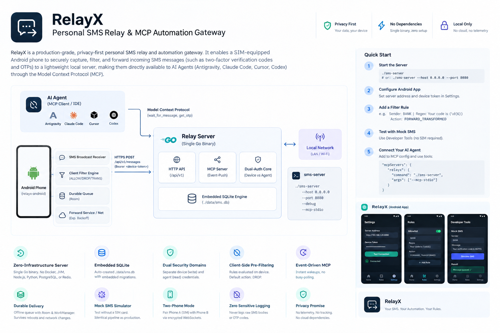

# RelayX - Personal SMS Relay & MCP Automation Gateway

**RelayX** is a production-grade, privacy-first personal SMS relay and automation gateway. It enables a SIM-equipped Android phone to securely capture, filter, and forward incoming SMS messages (such as two-factor verification codes and OTPs) to a lightweight local server, making them directly available to AI Agents (Antigravity, Claude Code, Cursor, Codex) through the **Model Context Protocol (MCP)**.

---



## Architecture Overview

```text
┌───────────────────────────┐
│         AI Agent          │
│   (MCP Client / IDE)      │
└─────────────┬─────────────┘
              │ Model Context Protocol (wait_for_message, get_otp)
              ▼
┌───────────────────────────────────────────────────────────┐
│              Relay Server (Single Go Binary)              │
│                                                           │
│  ┌──────────────┐  ┌──────────────┐  ┌─────────────────┐  │
│  │   HTTP API   │  │  MCP Server  │  │  Dual-Auth Core │  │
│  │  (/api/v1)   │  │  (Event-Push)│  │ (Device vs Agent│  │
│  └──────┬───────┘  └──────┬───────┘  └─────────────────┘  │
│         │                 │                               │
│         └────────┬────────┘                               │
│                  ▼                                        │
│     ┌────────────────────────┐                            │
│     │ Embedded SQLite Engine │ (./data/sms.db)            │
│     └────────────────────────┘                            │
└──────────────────────────▲────────────────────────────────┘
                           │ HTTPS POST /api/v1/messages
                           │ (Bearer <device-token>)
┌──────────────────────────┴────────────────────────────────┐
│              Android Phone (relayx-android)               │
│                                                           │
│  ┌──────────────────┐       ┌──────────────────────────┐  │
│  │ SMS Broadcast Rcv│       │ Mock SMS Simulator (Dev) │  │
│  └────────┬─────────┘       └────────────┬─────────────┘  │
│           └──────────────┬───────────────┘                │
│                          ▼                                │
│              ┌───────────────────────┐                    │
│              │ Client Filter Engine  │ (ALLOW/DROP/TRANS) │
│              └───────────┬───────────┘                    │
│                          ▼                                │
│              ┌───────────────────────┐                    │
│              │ Durable Queue (Room)  │ (Offline/Reboot)   │
│              └───────────┬───────────┘                    │
│                          ▼                                │
│              ┌───────────────────────┐                    │
│              │ Forward Service / Net │ (Exp. Backoff)     │
│              └───────────────────────┘                    │
└───────────────────────────────────────────────────────────┘
```

---

## Key Features

- **Zero-Infrastructure Server**: Compiled into a single self-contained Go binary. Requires **no** Docker, JVM, Node.js, Python, PostgreSQL, or Redis.
- **Embedded SQLite Database**: Automatically creates and initializes `./data/sms.db` with embedded migrations (`go:embed`) on first launch.
- **Dual Security Domains**: Android write token (`Bearer <device-token>`) only permits message ingestion. AI Agents require separate read credentials to query MCP endpoints.
- **Client-Side Pre-Filtering**: Rules are evaluated locally on the Android device *before* transmission. Default action is `DROP`, keeping personal SMS strictly on your phone.
- **Zero Sensitive Logging**: Standard and debug logs never record raw SMS bodies or OTP verification codes.
- **Event-Driven MCP Server**: The `wait_for_message` tool uses an internal Go event channel to wake waiting agents instantly with zero busy-polling.
- **Durable Delivery**: Offline queue powered by Android Room & WorkManager, surviving Wi-Fi changes, process death, and device reboots (`BOOT_COMPLETED`).
- **Complete Mock SMS Parity**: Interactive simulator in developer tools routes mock messages through the identical production filter and queue pipeline for seamless testing without a SIM card.
- **Optional Two-Phone Mode**: Pair Phone A (SIM receiver) with Phone B (Automation Client) via encrypted WebSockets for dedicated UI testing.

---

## Roadmap & Implementation Status

- [x] **Phase 1: Server Foundation (`relayx-server`)**: Standalone Go daemon, embedded SQLite WAL engine, embedded migrations, Bearer token authentication, idempotency deduplication, health monitoring, structured logging redaction, and ingestion hooks.
- [x] **Phase 2: Android Gateway Foundation (`relayx-android`)**: Kotlin 2.4.20, Compose Material 3, Navigation 3, Koin 4.2 App Startup, Room durable offline outbox, WorkManager exponential backoff dispatch, multipart SMS receiver, boot persistence, and zero-sensitive logging.
- [x] **Phase 3: Android Message Inspection & Detail Modal (`relayx-android`)**: Message list screen navigated from metric cards (Received, Forwarded, Filtered, Failed) with synchronized `HorizontalPager` tabs, real-time debounced search, animated chrome, and interactive bottom sheet for last message received with privacy masking.
- [ ] **Phase 4: Server Web Dashboard & Live Observability (`relayx-server`)**: Embedded Web UI in Go binary, real-time logcat streaming over SSE/WebSockets, SQLite database table browser, message history, and token management.
- [ ] **Phase 5: Local Pre-Filtering Engine & Security Rules (`relayx-android`)**: Rule editor UI, regex/substring matching, action policies (`ALLOW`, `DROP`, `TRANSFORM`), and test sandbox.
- [ ] **Phase 6: Agent MCP Server (`relayx-server`)**: Full Model Context Protocol implementation (`get_latest_message`, `wait_for_message`, `get_otp`).
- [ ] **Phase 7: Testing Infrastructure, Mock SMS & Emulator Relay**: Mock SMS injector, interactive sandbox, and automated E2E testing.
- [ ] **Phase 8: Two-Phone & Virtual Device Testing Mode**: Encrypted WebSocket synchronization, QR pairing, and two-phone automation mode.
- [ ] **Phase 9: Hardening, Packaging & Release**: Production signing, APK optimization, security audits, and cross-platform releases.

---

## Quickstart Guide

### 1. Build & Run the Go Server (`relayx-server`)

The server is built in Go with pure-Go SQLite (`modernc.org/sqlite`) for zero-CGO static cross-compilation:

```bash
# Navigate to server directory
cd relayx-server

# Build executable
go build -o ../bin/relayx-server ./cmd/server

# Start server (default: 127.0.0.1:8080, db: ./data/sms.db)
./bin/relayx-server

# Start with emulator auto-relay hook enabled
./bin/relayx-server --port 8080 --adb-port 5554 --token "secret-device-token"
```

On first launch, `./data/sms.db` is auto-created with embedded schema migrations applied.

### 2. Build & Install Android App (`relayx-android`)

The gateway app requires Android 7.0+ (API 24) through Android 15+ (API 37):

```bash
# Build and run unit test suite
./gradlew test

# Assemble debug APK
./gradlew assembleDebug

# Install onto connected phone or emulator
adb install -r relayx-android/build/outputs/apk/debug/relayx-android-debug.apk
```

### 3. Configure the Gateway

1. Open **RelayX** on your Android device.
2. Navigate to the **Settings** tab:
   - **Server Host**: `10.0.2.2` (for Android Emulator) or your LAN IP (e.g. `192.168.1.100`)
   - **Port**: `8080`
   - **Use HTTPS**: Disabled for local development (cleartext is scoped via `network_security_config.xml`)
   - **Device ID**: Auto-generated (or custom identifier)
   - **Device Bearer Token**: Must match `--token` specified on the server
3. Tap **Test Connection** to probe `/api/v1/health` and verify latency.
4. On the **Dashboard** tab, toggle **Gateway Active** to enable interception.

### 4. Inject Test SMS via Emulator Hook (No SIM Required)

You can simulate inbound SMS directly using Android ADB:

```bash
# Send test SMS from bank shortcode
adb emu sms send 12345 "Your verification code is 849201"
```

The gateway immediately intercepts the message, commits it to Room, masks the payload in logs, and dispatches it asynchronously to `relayx-server`.

---

## Server CLI Options

```text
relayx-server [OPTIONS]

Options:
  -host string        HTTP server bind address (default: "127.0.0.1")
  -port int           HTTP server listen port (default: 8080)
  -db string          SQLite database file path (default: "./data/sms.db")
  -token string       Authorized device Bearer token (enforces SHA-256 verification)
  -debug              Enable verbose diagnostic logging (body text remains redacted)
  -adb-port int       Android emulator port to relay SMS via adb emu sms send (e.g. 5554)
  -exec-hook string   Custom script hook to execute on message arrival
  -help               Display help information
```

---

## Security & Privacy Architecture

- **Constitution-Governed**: All design decisions strictly adhere to the [RelayX Constitution](.specify/memory/constitution.md).
- **Dual Security Domains**: Devices only hold write tokens for `POST /api/v1/messages`. MCP readers require separate credentials.
- **Physical Backup Disablement**: `android:allowBackup="false"` with explicit exclusions for SQLite and DataStore in `backup_rules.xml` and `data_extraction_rules.xml` prevents physical `adb backup` data extraction.
- **Scoped Cleartext Traffic**: `network_security_config.xml` blocks all external cleartext HTTP, restricting unencrypted traffic exclusively to `10.0.2.2`, `127.0.0.1`, and `localhost`.
- **CRLF Injection Hardened**: Server emulator hooks sanitize carriage returns (`\r`) and newlines (`\n`) to prevent telnet console injection.
- **Strict Zero-Sensitive Logging**: `RelayLogger` on Android and `RedactingHandler` on the server scrub message bodies, OTP codes, and auth headers.

---

## Project Structure

```text
relayx/
├── relayx-android/               # Android Gateway Application
│   ├── src/main/java/.../        # Kotlin 2.4 Compose + Room + WorkManager
│   │   ├── data/                 # Room DB, DAOs, DataStore Preferences, Receivers, Worker
│   │   ├── di/                   # Koin 4.2 modules & App Startup Initializer
│   │   ├── domain/               # Core models & Use Cases
│   │   ├── ui/                   # Jetpack Compose screens (Dashboard, Settings, NavGraph)
│   │   ├── util/                 # RelayLogger (privacy sanitizer), AppDispatchers
│   │   └── viewmodel/            # DashboardViewModel, SettingsViewModel
│   └── src/test/                 # Unit test suite (Preferences, Client, Privacy Logger)
├── relayx-server/                # Standalone Go Relay Daemon
│   ├── cmd/server/               # Entrypoint & CLI flag parser
│   ├── internal/api/             # HTTP routes, middleware, health, and message handlers
│   ├── internal/config/          # Configuration management
│   ├── internal/domain/          # Device and Message domain models
│   ├── internal/hook/            # ADB emulator & custom script relay hooks
│   ├── internal/logging/         # Structured privacy-redacting slog handler
│   ├── internal/service/         # Ingestion, authentication, and deduplication services
│   ├── internal/storage/         # Pure-Go SQLite WAL pool & embedded migrator
│   └── migrations/               # Embedded SQL migration scripts (001_initial.sql)
├── specs/                        # Spec-Driven Development (SDD) feature specifications
│   ├── 001-server-foundation/    # Phase 1 spec, plan, tasks, and QA reports
│   └── 002-android-gateway-foundation/ # Phase 2 spec, plan, tasks, and QA reports
└── docs/                         # Architecture, roadmap, security reviews, and memory hub
```

---

## Documentation

- [System Architecture](docs/memory/ARCHITECTURE.md)
- [Constitution & Core Principles](.specify/memory/constitution.md)
- [Architecture Decision Records (ADRs)](docs/memory/DECISIONS.md)
- [Bugs & Regression Patterns](docs/memory/BUGS.md)
- [Milestones & Worklog](docs/memory/WORKLOG.md)
- [Development Roadmap](docs/roadmap.md)
- [Memory Index](docs/memory/INDEX.md)
