# Task Dependencies & Execution Waves: Server Foundation

**Feature Branch**: `feature/001-server-foundation` | **Spec**: [spec.md](spec.md) | **Tasks**: [tasks.md](tasks.md)

---

## Dependency DAG (Phase Architecture)

```mermaid
flowchart TB
    subgraph P1["Phase 1: Setup"]
        T001["T001: Go module init"]
        T002["T002: Add sqlite/uuid deps"]
        T003["T003: Directory layout"]
        T004["T004: Makefile targets"]
        T001 --> T002
    end

    subgraph P2["Phase 2: Foundational Core"]
        T005["T005: CLI config parser"]
        T006["T006: Device entity"]
        T007["T007: Message entity"]
        T008["T008: SQL migration v1"]
        T009["T009: Embedded migrator"]
        T010["T010: SQLite WAL manager"]
        
        T008 --> T009
        T009 --> T010
    end

    subgraph P3["Phase 3: US1 Server Lifecycle"]
        T011["T011: Server main & shutdown"]
        T012["T012: HTTP server lifecycle"]
        T013["T013: Config unit test"]
        T014["T014: DB migration test"]
    end

    subgraph P4["Phase 4: US2 Ingestion & Idempotency"]
        T015["T015: SQLite Device repo"]
        T016["T016: SQLite Message repo"]
        T017["T017: Device auth service"]
        T018["T018: Ingestion service"]
        T019["T019: Bearer auth middleware"]
        T020["T020: Ingestion HTTP handler"]
        T021["T021: Auth middleware test"]
        T022["T022: Ingestion integration test"]

        T015 --> T017
        T016 --> T018
        T017 --> T019
        T018 --> T020
        T019 --> T020
        T019 --> T021
        T020 --> T022
    end

    subgraph P5["Phase 5: US3 Querying & Health"]
        T023["T023: Health check handler"]
        T024["T024: Message query repo"]
        T025["T025: Message query handlers"]
        T026["T026: Health unit test"]
        T027["T027: Query integration test"]

        T023 --> T026
        T024 --> T025
        T025 --> T027
    end

    subgraph P6["Phase 6: US4 Privacy Logging"]
        T028["T028: Redacting log handler"]
        T029["T029: HTTP log middleware"]
        T030["T030: Zero-leakage log test"]

        T028 --> T029
        T029 --> T030
    end

    subgraph P7["Phase 7: Polish & Verification"]
        T031["T031: Quickstart curl test"]
        T032["T032: Cross-compile validation"]
        T033["T033: Full test suite run"]

        T031 --> T033
        T032 --> T033
    end

    %% Cross-Phase Dependencies
    T001 --> T005
    T001 --> T006
    T001 --> T007
    T002 --> T009
    T002 --> T010
    T003 --> T008

    T005 --> T012
    T005 --> T013
    T005 --> T028
    T010 --> T011
    T010 --> T014
    T010 --> T015
    T010 --> T016
    T010 --> T023
    T012 --> T011
    T012 --> T029

    T006 --> T015
    T007 --> T016
    T016 --> T024
    T018 --> T025

    T004 --> T032
    T011 --> T032
    T020 --> T031
    T025 --> T031
    T029 --> T031

    %% Status Styling: All 33 Tasks Completed (Green)
    style T001 fill:#4CAF50,stroke:#2E7D32,color:#fff
    style T002 fill:#4CAF50,stroke:#2E7D32,color:#fff
    style T003 fill:#4CAF50,stroke:#2E7D32,color:#fff
    style T004 fill:#4CAF50,stroke:#2E7D32,color:#fff
    style T005 fill:#4CAF50,stroke:#2E7D32,color:#fff
    style T006 fill:#4CAF50,stroke:#2E7D32,color:#fff
    style T007 fill:#4CAF50,stroke:#2E7D32,color:#fff
    style T008 fill:#4CAF50,stroke:#2E7D32,color:#fff
    style T009 fill:#4CAF50,stroke:#2E7D32,color:#fff
    style T010 fill:#4CAF50,stroke:#2E7D32,color:#fff
    style T011 fill:#4CAF50,stroke:#2E7D32,color:#fff
    style T012 fill:#4CAF50,stroke:#2E7D32,color:#fff
    style T013 fill:#4CAF50,stroke:#2E7D32,color:#fff
    style T014 fill:#4CAF50,stroke:#2E7D32,color:#fff
    style T015 fill:#4CAF50,stroke:#2E7D32,color:#fff
    style T016 fill:#4CAF50,stroke:#2E7D32,color:#fff
    style T017 fill:#4CAF50,stroke:#2E7D32,color:#fff
    style T018 fill:#4CAF50,stroke:#2E7D32,color:#fff
    style T019 fill:#4CAF50,stroke:#2E7D32,color:#fff
    style T020 fill:#4CAF50,stroke:#2E7D32,color:#fff
    style T021 fill:#4CAF50,stroke:#2E7D32,color:#fff
    style T022 fill:#4CAF50,stroke:#2E7D32,color:#fff
    style T023 fill:#4CAF50,stroke:#2E7D32,color:#fff
    style T024 fill:#4CAF50,stroke:#2E7D32,color:#fff
    style T025 fill:#4CAF50,stroke:#2E7D32,color:#fff
    style T026 fill:#4CAF50,stroke:#2E7D32,color:#fff
    style T027 fill:#4CAF50,stroke:#2E7D32,color:#fff
    style T028 fill:#4CAF50,stroke:#2E7D32,color:#fff
    style T029 fill:#4CAF50,stroke:#2E7D32,color:#fff
    style T030 fill:#4CAF50,stroke:#2E7D32,color:#fff
    style T031 fill:#4CAF50,stroke:#2E7D32,color:#fff
    style T032 fill:#4CAF50,stroke:#2E7D32,color:#fff
    style T033 fill:#4CAF50,stroke:#2E7D32,color:#fff
```



---

## Execution Waves

| Wave | Tasks | Readiness Criteria |
| :--- | :--- | :--- |
| **Wave 1** | [T001](tasks.md#L11), [T003](tasks.md#L13), [T004](tasks.md#L14) | **Completed** ✅ |
| **Wave 2** | [T002](tasks.md#L12), [T005](tasks.md#L24), [T006](tasks.md#L25), [T007](tasks.md#L26), [T008](tasks.md#L27) | **Completed** ✅ |
| **Wave 3** | [T009](tasks.md#L28), [T012](tasks.md#L44), [T013](tasks.md#L45), [T028](tasks.md#L99) | **Completed** ✅ |
| **Wave 4** | [T010](tasks.md#L29), [T029](tasks.md#L100) | **Completed** ✅ |
| **Wave 5** | [T011](tasks.md#L43), [T014](tasks.md#L46), [T015](tasks.md#L60), [T016](tasks.md#L61), [T023](tasks.md#L81), [T030](tasks.md#L101) | **Completed** ✅ |
| **Wave 6** | [T017](tasks.md#L62), [T018](tasks.md#L63), [T024](tasks.md#L82), [T026](tasks.md#L84), [T032](tasks.md#L112) | **Completed** ✅ |
| **Wave 7** | [T019](tasks.md#L64), [T025](tasks.md#L83) | **Completed** ✅ |
| **Wave 8** | [T020](tasks.md#L65), [T021](tasks.md#L66), [T027](tasks.md#L85) | **Completed** ✅ |
| **Wave 9** | [T022](tasks.md#L67), [T031](tasks.md#L111) | **Completed** ✅ |
| **Wave 10**| [T033](tasks.md#L113) | **Completed** ✅ |

---

## Legend & Status

- 🟢 **Green** — Task completed (`33`)
- 🟡 **Yellow** — Task ready to start immediately (`0`)
- ⚪ **Gray** — Task blocked awaiting prerequisite dependencies (`0`)

---

## Critical Path

```text
T001 (Init Go module) ✅
 └──> T002 (Add sqlite/uuid deps) ✅
       └──> T009 (Embedded migration runner) ✅
             └──> T010 (SQLite WAL manager) ✅
                   └──> T016 (SQLite Message repo) ✅
                         └──> T018 (Message ingestion service) ✅
                               └──> T020 (Ingestion HTTP handler) ✅
                                     └──> T022 (Ingestion integration test) ✅
                                           └──> T031 (Quickstart curl verification) ✅
                                                 └──> T033 (Full server test suite) ✅
```
*Total Critical Path Length: 10 sequential tasks — All Complete.*

---

## Statistics

- **Total Tasks**: 33
- **Completed**: 33 (100%)
- **Ready to Start**: 0
- **Blocked**: 0
- **Execution Waves**: 10 (All Waves Complete)
- **Acyclic Verification**: ✅ Passed (DAG has zero cycles)
