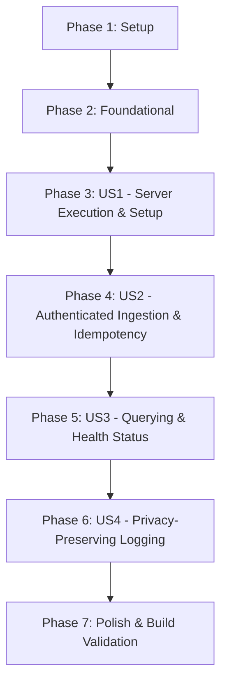

# Tasks: Server Foundation

**Feature Branch**: `feature/001-server-foundation` | **Date**: 2026-09-07 | **Spec**: [spec.md](spec.md) | **Plan**: [plan.md](plan.md)

---

## Phase 1: Setup (Project Initialization)

**Purpose**: Establish the standalone Go server module and development tooling.

- [x] T001 Initialize Go module `relayx-server` with Go 1.22+ toolchain in `relayx-server/go.mod`
- [x] T002 Add dependencies `modernc.org/sqlite` and `github.com/google/uuid` to `relayx-server/go.mod`
- [x] T003 [P] Create directory structure per implementation plan under `relayx-server/`
- [x] T004 [P] Create cross-platform compilation targets and build script in `relayx-server/Makefile`

---

## Phase 2: Foundational (Blocking Prerequisites)

**Purpose**: Core configuration, domain entities, embedded migrations, and database connection.

**⚠️ CRITICAL**: Must complete before user story implementation begins.

- [x] T005 Implement CLI configuration and flag parser in `relayx-server/internal/config/config.go`
- [x] T006 [P] Define Device entity and repository interface in `relayx-server/internal/domain/device.go`
- [x] T007 [P] Define Message entity and repository interface in `relayx-server/internal/domain/message.go`
- [x] T008 [P] Define Initial SQL schema migration in `relayx-server/migrations/001_initial.sql`
- [x] T009 Implement embedded migration runner with `embed.FS` in `relayx-server/internal/storage/migrator.go`
- [x] T010 Implement SQLite connection manager with WAL mode and pragmas in `relayx-server/internal/storage/sqlite.go`

**Checkpoint**: Foundation ready — database auto-connects, runs embedded migrations, and entities are defined.

---

## Phase 3: User Story 1 - Self-Contained Server Execution & Auto-Setup (Priority: P1) 🎯 MVP

**Goal**: Execute a single server binary that auto-creates `./data/sms.db`, listens on `127.0.0.1:8080`, and handles graceful shutdown.

**Independent Test**: Run `go run ./relayx-server/cmd/server`, verify `./data/sms.db` creation and migrations, verify clean exit on `Ctrl+C` (SIGINT/SIGTERM) within 5 seconds.

### Implementation for User Story 1

- [x] T011 [US1] Implement server initialization and graceful shutdown handler in `relayx-server/cmd/server/main.go`
- [x] T012 [US1] Implement HTTP server lifecycle wrapper with graceful shutdown in `relayx-server/internal/api/server.go`
- [x] T013 [P] [US1] Unit test for configuration defaults and flag overrides in `relayx-server/internal/config/config_test.go`
- [x] T014 [P] [US1] Integration test for auto-database creation and migration execution in `relayx-server/internal/storage/sqlite_test.go`

**Checkpoint**: User Story 1 complete — server binary starts with zero external setup, initializes database, and shuts down cleanly.

---

## Phase 4: User Story 2 - Authenticated Ingestion & Idempotent Storage (Priority: P1)

**Goal**: Authenticated `POST /api/v1/messages` endpoint that persists SMS with `RECEIVED` status and deduplicates on `messageId`.

**Independent Test**: Send `POST /api/v1/messages` with valid Bearer token, assert HTTP 201 and SQLite record. Resend same `messageId`, assert HTTP 200 without duplicate row. Send without token, assert HTTP 401.

### Implementation for User Story 2

- [x] T015 [US2] Implement SQLite Device repository with token lookup in `relayx-server/internal/storage/device_repo.go`
- [x] T016 [US2] Implement SQLite Message repository with `ON CONFLICT` deduplication in `relayx-server/internal/storage/message_repo.go`
- [x] T017 [P] [US2] Implement Device authentication service in `relayx-server/internal/service/device_service.go`
- [x] T018 [P] [US2] Implement Message ingestion service in `relayx-server/internal/service/message_service.go`
- [x] T019 [US2] Implement Bearer token authentication middleware in `relayx-server/internal/api/middleware.go`
- [x] T020 [US2] Implement `POST /api/v1/messages` HTTP handler with validation in `relayx-server/internal/api/messages.go`
- [x] T021 [P] [US2] Unit test for Bearer token validation middleware in `relayx-server/internal/api/middleware_test.go`
- [x] T022 [P] [US2] Integration test for message ingestion and idempotency in `relayx-server/internal/api/messages_test.go`

**Checkpoint**: User Story 2 complete — mobile gateways can securely and idempotently ingest SMS.

---

## Phase 5: User Story 3 - Message Querying & Server Health Status (Priority: P2)

**Goal**: Provide `GET /api/v1/health` and filtered message query endpoints (`GET /api/v1/messages`, `/messages/latest`, `/messages/{id}`).

**Independent Test**: Query `/health` asserting 200 OK with uptime and database status. Seed test messages, query `/messages?sender=BANK` and verify ordered filtering and pagination.

### Implementation for User Story 3

- [x] T023 [P] [US3] Implement `GET /api/v1/health` handler in `relayx-server/internal/api/health.go`
- [x] T024 [US3] Implement message query and retrieval methods in `relayx-server/internal/storage/message_repo.go`
- [x] T025 [US3] Implement `GET /api/v1/messages`, `GET /messages/latest`, and `GET /messages/{id}` in `relayx-server/internal/api/messages.go`
- [x] T026 [P] [US3] Unit test for health endpoint in `relayx-server/internal/api/health_test.go`
- [x] T027 [P] [US3] Integration test for message filtering and pagination in `relayx-server/internal/api/query_test.go`

**Checkpoint**: User Story 3 complete — operational monitoring and historical query endpoints active.

---

## Phase 6: User Story 4 - Privacy-Preserving Diagnostic Logging (Priority: P3)

**Goal**: Guarantee zero leakage of SMS bodies or OTP verification codes in standard and debug logs.

**Independent Test**: Send messages with simulated OTPs with `--debug` enabled, capture stdout/stderr, assert that raw bodies and OTP tokens are completely absent.

### Implementation for User Story 4

- [x] T028 [US4] Implement privacy-redacting structured logger handler in `relayx-server/internal/logging/logger.go`
- [x] T029 [US4] Implement HTTP request/response logging middleware with field masking in `relayx-server/internal/api/middleware.go`
- [x] T030 [P] [US4] Automated test asserting zero sensitive data leakage in logs in `relayx-server/internal/logging/logger_test.go`

**Checkpoint**: User Story 4 complete — strict privacy guarantees verified by automated tests.

---

## Phase 7: Polish & Cross-Cutting Concerns

**Purpose**: End-to-end verification, cross-compilation validation, and documentation alignment.

- [x] T031 [P] Validate quickstart guide end-to-end with curl commands per `specs/001-server-foundation/quickstart.md`
- [x] T032 Verify cross-compilation of `relayx-server` for Linux AMD64/ARM64 and macOS AMD64/ARM64 via `relayx-server/Makefile`
- [x] T033 Run complete server test suite with `rtk go test -v ./...` in `relayx-server/`

---

## Dependencies & Execution Order

> Detailed execution waves, DAG visual, and critical path analysis: [task-dependencies.md](task-dependencies.md)

### Parallel Opportunities

- **Phase 1**: T003 (directory layout) and T004 (Makefile) can run in parallel.
- **Phase 2**: T006 (Device entity), T007 (Message entity), and T008 (SQL migration) can run in parallel.
- **Phase 4**: T017 (Device service) and T018 (Message service) can run in parallel; T021 and T022 tests can run in parallel.
- **Phase 5**: T023 (Health handler) can run in parallel with repository query extensions.
- **Phase 6**: T028 and T030 test harness can be authored in parallel.

---

## Implementation Strategy

### MVP Scope (User Story 1 & 2)
1. Complete Setup (Phase 1) & Foundational (Phase 2).
2. Complete User Story 1: Binary compiles, starts, auto-creates database, shuts down cleanly.
3. Complete User Story 2: Ingests SMS over HTTP POST with authentication and deduplication.
4. Verify MVP using `curl` against `http://127.0.0.1:8080/api/v1/messages`.
