# Task Dependency Graph: Android Gateway Foundation

**Feature**: `specs/002-android-gateway-foundation`
**Date**: 2026-09-11

---

```mermaid
flowchart TD
    subgraph Wave_1["Wave 1: Build Config"]
        T001["T001: Configure libs.versions.toml"]
    end

    subgraph Wave_2["Wave 2: Setup & Manifest"]
        T002["T002: Apply Gradle plugins"]
        T003["T003: Configure Android Manifest"]
    end

    subgraph Wave_3["Wave 3: Core Domain & Data Models"]
        T004["T004: RelayLogger utility"]
        T005["T005: Domain models"]
        T006["T006: PreferencesRepository"]
        T007["T007: OutboxMessageEntity"]
        T011["T011: Network DTOs"]
    end

    subgraph Wave_4["Wave 4: DAO & Network Client"]
        T008["T008: OutboxMessageDao"]
        T012["T012: RelayServerClient"]
    end

    subgraph Wave_5["Wave 5: Database & Ping UseCase"]
        T009["T009: RelayDatabase"]
        T013["T013: TestConnectionUseCase"]
    end

    subgraph Wave_6["Wave 6: Application & UseCases"]
        T010["T010: RelayApplication"]
        T014["T014: SettingsViewModel"]
        T016["T016: DashboardUseCases"]
        T020["T020: IngestSmsUseCase"]
    end

    subgraph Wave_7["Wave 7: Settings UI & Receiver"]
        T015["T015: SettingsScreen"]
        T017["T017: DashboardViewModel"]
        T021["T021: SmsReceiver"]
        T023["T023: DispatchOutboxUseCase"]
    end

    subgraph Wave_8["Wave 8: Dashboard UI & Worker"]
        T018["T018: DashboardScreen"]
        T022["T022: Permission request flow"]
        T024["T024: MessageDispatchWorker"]
    end

    subgraph Wave_9["Wave 9: Navigation & Boot Hook"]
        T019["T019: RelayNavGraph & MainActivity"]
        T025["T025: Wire dispatch triggers"]
        T026["T026: BootReceiver"]
    end

    subgraph Wave_10["Wave 10: Manifest Boot & Privacy Audit"]
        T027["T027: Register Boot in Manifest"]
        T028["T028: Audit privacy logging"]
    end

    subgraph Wave_11["Wave 11: Unit Test Suite"]
        T029["T029: RelayLoggerTest"]
        T030["T030: PreferencesRepositoryTest"]
        T031["T031: RelayServerClientTest"]
    end

    subgraph Wave_12["Wave 12: Quality Gate"]
        T032["T032: Full verification suite"]
    end

    %% Dependency Edges
    T001 --> T002
    T001 --> T003

    T002 --> T004
    T002 --> T005
    T002 --> T006
    T002 --> T007
    T002 --> T011

    T007 --> T008
    T004 --> T012
    T006 --> T012
    T011 --> T012

    T008 --> T009
    T012 --> T013

    T009 --> T010
    T006 --> T010
    T006 --> T014
    T013 --> T014
    T009 --> T016
    T006 --> T016
    T009 --> T020

    T014 --> T015
    T016 --> T017
    T020 --> T021
    T004 --> T021
    T009 --> T023
    T012 --> T023

    T017 --> T018
    T015 --> T018
    T018 --> T022
    T003 --> T022
    T023 --> T024
    T006 --> T024

    T018 --> T019
    T015 --> T019
    T021 --> T025
    T024 --> T025
    T024 --> T026
    T006 --> T026

    T026 --> T027
    T003 --> T027
    T025 --> T028
    T004 --> T028

    T028 --> T029
    T006 --> T030
    T012 --> T031

    T019 --> T032
    T022 --> T032
    T025 --> T032
    T027 --> T032
    T029 --> T032
    T030 --> T032
    T031 --> T032

    %% Styles: All currently pending (Yellow = ready Wave 1, Gray = blocked)
    style T001 fill:#FFC107,stroke:#333,stroke-width:1px,color:#000
    style T002 fill:#ECEFF1,stroke:#90A4AE,stroke-width:1px,color:#37474F
    style T003 fill:#ECEFF1,stroke:#90A4AE,stroke-width:1px,color:#37474F
    style T004 fill:#ECEFF1,stroke:#90A4AE,stroke-width:1px,color:#37474F
    style T005 fill:#ECEFF1,stroke:#90A4AE,stroke-width:1px,color:#37474F
    style T006 fill:#ECEFF1,stroke:#90A4AE,stroke-width:1px,color:#37474F
    style T007 fill:#ECEFF1,stroke:#90A4AE,stroke-width:1px,color:#37474F
    style T008 fill:#ECEFF1,stroke:#90A4AE,stroke-width:1px,color:#37474F
    style T009 fill:#ECEFF1,stroke:#90A4AE,stroke-width:1px,color:#37474F
    style T010 fill:#ECEFF1,stroke:#90A4AE,stroke-width:1px,color:#37474F
    style T011 fill:#ECEFF1,stroke:#90A4AE,stroke-width:1px,color:#37474F
    style T012 fill:#ECEFF1,stroke:#90A4AE,stroke-width:1px,color:#37474F
    style T013 fill:#ECEFF1,stroke:#90A4AE,stroke-width:1px,color:#37474F
    style T014 fill:#ECEFF1,stroke:#90A4AE,stroke-width:1px,color:#37474F
    style T015 fill:#ECEFF1,stroke:#90A4AE,stroke-width:1px,color:#37474F
    style T016 fill:#ECEFF1,stroke:#90A4AE,stroke-width:1px,color:#37474F
    style T017 fill:#ECEFF1,stroke:#90A4AE,stroke-width:1px,color:#37474F
    style T018 fill:#ECEFF1,stroke:#90A4AE,stroke-width:1px,color:#37474F
    style T019 fill:#ECEFF1,stroke:#90A4AE,stroke-width:1px,color:#37474F
    style T020 fill:#ECEFF1,stroke:#90A4AE,stroke-width:1px,color:#37474F
    style T021 fill:#ECEFF1,stroke:#90A4AE,stroke-width:1px,color:#37474F
    style T022 fill:#ECEFF1,stroke:#90A4AE,stroke-width:1px,color:#37474F
    style T023 fill:#ECEFF1,stroke:#90A4AE,stroke-width:1px,color:#37474F
    style T024 fill:#ECEFF1,stroke:#90A4AE,stroke-width:1px,color:#37474F
    style T025 fill:#ECEFF1,stroke:#90A4AE,stroke-width:1px,color:#37474F
    style T026 fill:#ECEFF1,stroke:#90A4AE,stroke-width:1px,color:#37474F
    style T027 fill:#ECEFF1,stroke:#90A4AE,stroke-width:1px,color:#37474F
    style T028 fill:#ECEFF1,stroke:#90A4AE,stroke-width:1px,color:#37474F
    style T029 fill:#ECEFF1,stroke:#90A4AE,stroke-width:1px,color:#37474F
    style T030 fill:#ECEFF1,stroke:#90A4AE,stroke-width:1px,color:#37474F
    style T031 fill:#ECEFF1,stroke:#90A4AE,stroke-width:1px,color:#37474F
    style T032 fill:#ECEFF1,stroke:#90A4AE,stroke-width:1px,color:#37474F
```



## Legend
- 🟡 Yellow — Task ready to execute (Wave 1: T001)
- ⚪ Gray — Task blocked on upstream dependencies
- 🟢 Green — Task completed

## Critical Path Analysis
The primary critical path represents the longest chain of blocking technical dependencies:
```text
T001 (Config) 
  └─> T002 (Gradle Plugins)
        └─> T007 (Room Entity)
              └─> T008 (Room DAO)
                    └─> T009 (Room Database)
                          └─> T020 (Ingest UseCase)
                                └─> T021 (SMS Receiver)
                                      └─> T023 (Dispatch UseCase)
                                            └─> T024 (Dispatch Worker)
                                                  └─> T025 (Wire Triggers)
                                                        └─> T028 (Privacy Audit)
                                                              └─> T032 (Full Verification)
```
Chain Length: **12 sequential tasks**

## Execution Statistics
- **Total Tasks**: 32
- **Completed**: 0 (0%)
- **Ready to Start**: 1 (T001 in Wave 1)
- **Blocked**: 31
- **Total Execution Waves**: 12
