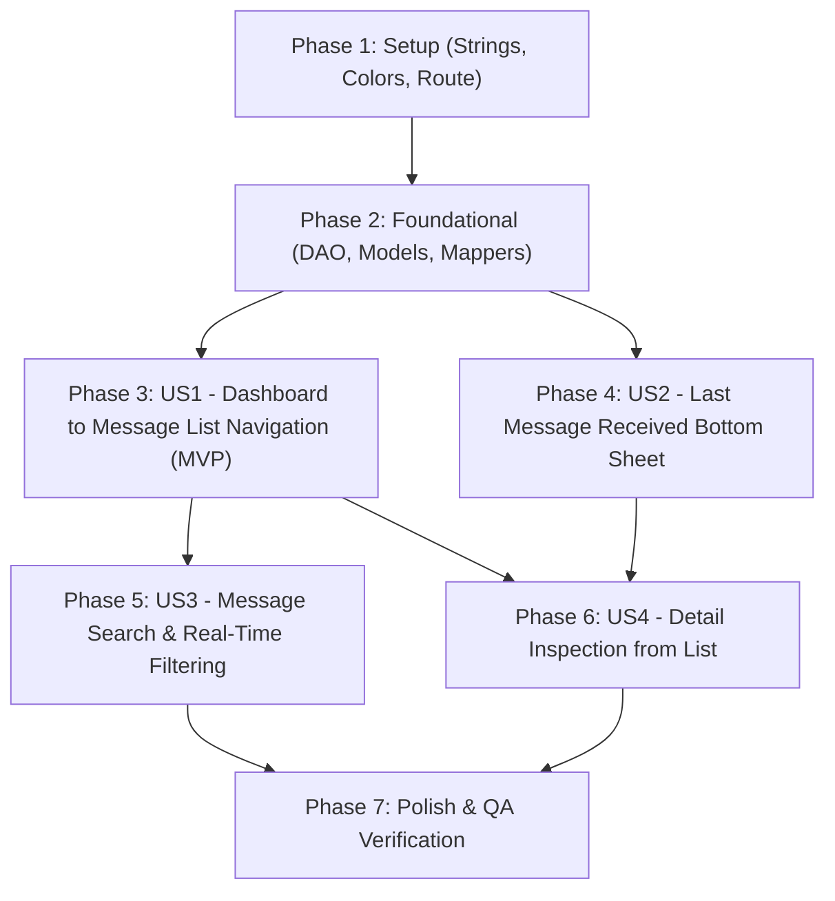

# Tasks: Android Message Inspection & Detail Modal

**Feature**: `specs/003-android-message-inspection`  
**Date**: 2026-09-12  
**Input**: Feature specification (`spec.md`), implementation plan (`plan.md`), data models (`data-model.md`), and UI contract (`contracts/message-inspection-ui.md`).

---

## Phase 1: Setup (Shared Infrastructure)

**Purpose**: Add string resources, color tokens, and navigation route definitions required by all subsequent phases.

- [ ] T001 [P] Add string resources for message inspection (filter titles, bottom sheet labels, retry button, copy feedback, empty state text) in `relayx-android/src/main/res/values/strings.xml`
- [ ] T002 [P] Define delivery status color helpers and theme tokens (Delivered green, Failed red, Pending amber/orange, Filtered neutral) in `relayx-android/src/main/java/com/parsomash/relayx/ui/theme/Color.kt`
- [ ] T003 [P] Add `AppRoute.MessageList(val initialFilter: String = "ALL")` route definition in `relayx-android/src/main/java/com/parsomash/relayx/ui/navigation/RelayNavGraph.kt`

---

## Phase 2: Foundational (Blocking Prerequisites)

**Purpose**: Core data layer queries, domain models, and UI presentation entities that MUST be complete before user stories can be implemented.

**⚠️ CRITICAL**: Blocks implementation of all user stories.

- [ ] T004 Add Room DAO queries in `OutboxMessageDao.kt`: `observeAllMessages(): Flow<List<OutboxMessageEntity>>`, `observeLatestMessage(): Flow<OutboxMessageEntity?>`, and `resetForRetry(id: String, now: Long): Int` in `relayx-android/src/main/java/com/parsomash/relayx/data/local/OutboxMessageDao.kt`
- [ ] T005 [P] Create `MessageFilter` enum (`ALL`, `PENDING`, `FORWARDED`, `FAILED`, `FILTERED`) with `fromString` mapper in `relayx-android/src/main/java/com/parsomash/relayx/domain/model/MessageFilter.kt`
- [ ] T006 [P] Create `MessageListItem` and `MessageDetail` presentation models with entity mappers (`OutboxMessageEntity.toListItem()`, `OutboxMessageEntity.toDetail()`) in `relayx-android/src/main/java/com/parsomash/relayx/domain/model/MessageInspectionModels.kt`
- [ ] T007 Unit test DAO queries and mapper logic with Coroutines/Turbine in `relayx-android/src/test/java/com/parsomash/relayx/data/local/OutboxMessageDaoTest.kt`

**Checkpoint**: Core data access and domain presentation models verified with unit tests. User story development can now proceed.

---

## Phase 3: User Story 1 - Navigate to Message List from Dashboard Throughput Cards (Priority: P1) 🎯 MVP

**Goal**: Make Dashboard throughput metric cards clickable with ripple feedback, navigating to a dedicated Message List screen with the corresponding filter tab pre-selected.

**Independent Test**: Tap each metric card on the Dashboard (Received, Forwarded, Failed, Filtered) and verify that the app navigates to `MessageListScreen` with the respective filter tab selected (`ALL`, `FORWARDED`, `FAILED`, `FILTERED`), and that the top app bar back arrow returns to Dashboard.

### Tests for User Story 1 ⚠️
- [ ] T008 [P] [US1] Unit test `MessageListViewModel` initial filter initialization and tab selection in `relayx-android/src/test/java/com/parsomash/relayx/viewmodel/MessageListViewModelTest.kt`

### Implementation for User Story 1
- [ ] T009 [US1] Implement `MessageListViewModel` with `selectedFilter` state flow, filter change handler, and Room `observeAllMessages` collection in `relayx-android/src/main/java/com/parsomash/relayx/viewmodel/MessageListViewModel.kt`
- [ ] T010 [US1] Register `MessageListViewModel` in Koin dependency injection module in `relayx-android/src/main/java/com/parsomash/relayx/di/AppModule.kt`
- [ ] T011 [US1] Build `MessageItemCard` composable displaying sender, relative time, status badge, and retry attempts in `relayx-android/src/main/java/com/parsomash/relayx/ui/message/MessageItemCard.kt`
- [ ] T012 [US1] Build `MessageListScreen` scaffolding with `TopAppBar` (back arrow + title), scrollable `ScrollableTabRow` for filters, `LazyColumn` for message items, and empty state container in `relayx-android/src/main/java/com/parsomash/relayx/ui/message/MessageListScreen.kt`
- [ ] T013 [US1] Wire `AppRoute.MessageList` entry into `navigationModule` with `onBackClick` handling in `relayx-android/src/main/java/com/parsomash/relayx/ui/navigation/RelayNavGraph.kt`
- [ ] T014 [US1] Update `CounterCard` and `DashboardScreen` to accept `onClick: (String) -> Unit` and navigate to `AppRoute.MessageList` with the corresponding filter string in `relayx-android/src/main/java/com/parsomash/relayx/ui/dashboard/DashboardScreen.kt`

**Checkpoint**: User Story 1 is fully functional as an MVP. Dashboard counters navigate directly to the filtered message list, and back navigation returns cleanly to Dashboard.

---

## Phase 4: User Story 2 - Message Detail Modal Bottom Sheet for "Last Message Received" (Priority: P1)

**Goal**: Tapping the "Last Message Received" card on the Dashboard opens a Modal Bottom Sheet showing full message metadata, failure diagnostics, privacy-masked payload with eye reveal toggle, and a one-tap retry button.

**Independent Test**: Seed a message in Room, tap "Last Message Received" on Dashboard, verify bottom sheet displays UUID, sender, status, and masked payload `••••••`. Tap eye toggle to reveal text. Tap "Retry Delivery" for a failed message and verify status resets to `PENDING` and WorkManager dispatch is enqueued.

### Tests for User Story 2 ⚠️
- [ ] T015 [P] [US2] Unit test retry dispatch logic in `DashboardViewModelTest` / `MessageListViewModelTest` ensuring UUID is preserved and worker is triggered in `relayx-android/src/test/java/com/parsomash/relayx/viewmodel/MessageRetryTest.kt`

### Implementation for User Story 2
- [ ] T016 [US2] Build reusable `MessageDetailBottomSheet` composable with UUID copy action, status chip, relative & absolute timestamps, privacy-masked body with eye toggle button, failure diagnostics card, and "Retry Delivery" button in `relayx-android/src/main/java/com/parsomash/relayx/ui/message/MessageDetailBottomSheet.kt`
- [ ] T017 [US2] Expose `latestMessage: StateFlow<MessageDetail?>` and `retryMessage(id: String)` in `DashboardViewModel` in `relayx-android/src/main/java/com/parsomash/relayx/viewmodel/DashboardViewModel.kt`
- [ ] T018 [US2] Wire "Last Message Received" `StatusCard` in `DashboardScreen` to be clickable, maintaining bottom sheet state and presenting `MessageDetailBottomSheet` when tapped in `relayx-android/src/main/java/com/parsomash/relayx/ui/dashboard/DashboardScreen.kt`

**Checkpoint**: User Story 2 is functional. Latest message details can be inspected and retried directly from Dashboard with privacy masking enabled by default.

---

## Phase 5: User Story 3 - Message Search & Real-Time Filtering in Message List (Priority: P2)

**Goal**: Enable real-time search on the Message List screen to filter messages by sender address or message UUID, with debounce and clear button.

**Independent Test**: Open the Message List screen, type a sender name or partial UUID into the search field, verify the list filters in real time (< 50ms) matching both search query and active tab filter. Tap clear button (X) and verify the query resets.

### Tests for User Story 3 ⚠️
- [ ] T019 [P] [US3] Unit test search query filtering and tab intersection logic in `MessageListViewModelTest` in `relayx-android/src/test/java/com/parsomash/relayx/viewmodel/MessageListSearchTest.kt`

### Implementation for User Story 3
- [ ] T020 [US3] Add search query StateFlow, debounced filtering, and clear action in `MessageListViewModel` in `relayx-android/src/main/java/com/parsomash/relayx/viewmodel/MessageListViewModel.kt`
- [ ] T021 [US3] Add `OutlinedTextField` / `SearchBar` composable with search icon, placeholder, and trailing clear (X) icon in `relayx-android/src/main/java/com/parsomash/relayx/ui/message/MessageListScreen.kt`
- [ ] T022 [US3] Implement dynamic empty search state ("No messages matching '{query}' in {filter}") in `relayx-android/src/main/java/com/parsomash/relayx/ui/message/MessageListScreen.kt`

**Checkpoint**: Real-time search and multi-criteria tab filtering work seamlessly with zero lag.

---

## Phase 6: User Story 4 - Detail Inspection for Any Message from List (Priority: P2)

**Goal**: Tapping any message card in the Message List screen opens the same comprehensive `MessageDetailBottomSheet` to inspect metadata and retry older failures.

**Independent Test**: Tap any item in the Message List, verify that the `MessageDetailBottomSheet` opens with that specific message's data. Tap "Retry Delivery" on a failed item and verify that it immediately transitions to pending dispatch.

### Tests for User Story 4 ⚠️
- [ ] T023 [P] [US4] Unit test list item selection, bottom sheet presentation state, and retry action in `MessageListViewModelTest` in `relayx-android/src/test/java/com/parsomash/relayx/viewmodel/MessageListSelectionTest.kt`

### Implementation for User Story 4
- [ ] T024 [US4] Add `selectedMessage: StateFlow<MessageDetail?>` and `retryMessage(id: String)` in `MessageListViewModel` in `relayx-android/src/main/java/com/parsomash/relayx/viewmodel/MessageListViewModel.kt`
- [ ] T025 [US4] Connect `MessageItemCard` click events in `MessageListScreen` to select the message and present `MessageDetailBottomSheet` in `relayx-android/src/main/java/com/parsomash/relayx/ui/message/MessageListScreen.kt`

**Checkpoint**: All historical messages can be inspected and retried from the Message List screen.

---

## Phase 7: Polish & Cross-Cutting Concerns

**Purpose**: Verification, security audits, accessibility compliance, and end-to-end QA.

- [ ] T026 [P] Verify Constitution Principle III compliance: Ensure zero raw message bodies or OTP codes are printed to Logcat during inspection in `relayx-android/src/main/java/com/parsomash/relayx/util/RelayLogger.kt`
- [ ] T027 [P] Execute full Android unit test suite with `rtk ./gradlew test` to ensure all existing and new tests pass
- [ ] T028 Build clean debug APK with `rtk ./gradlew assembleDebug`
- [ ] T029 Execute live device/emulator verification following `specs/003-android-message-inspection/quickstart.md`
- [ ] T030 Document QA results and verification artifacts in `specs/003-android-message-inspection/qa/`

---

## Dependencies & Execution Order

### Phase Dependencies
- **Setup (Phase 1)**: No dependencies — can start immediately.
- **Foundational (Phase 2)**: Depends on Phase 1 completion. **BLOCKS** all user stories.
- **User Story 1 (Phase 3)**: Depends on Phase 2 completion. Delivers the core navigation & list MVP.
- **User Story 2 (Phase 4)**: Depends on Phase 2 completion. Can be implemented in parallel with or after US1.
- **User Story 3 (Phase 5)**: Depends on Phase 3 (extends `MessageListScreen`).
- **User Story 4 (Phase 6)**: Depends on Phase 3 (`MessageListScreen`) and Phase 4 (`MessageDetailBottomSheet`).
- **Polish (Phase 7)**: Depends on all user stories being complete.

### User Story Dependency Graph

---

## Parallel Opportunities

- **Phase 1**: T001 (`strings.xml`), T002 (`Color.kt`), and T003 (`RelayNavGraph.kt`) can all run in parallel.
- **Phase 2**: T005 (`MessageFilter.kt`) and T006 (`MessageInspectionModels.kt`) can run in parallel with T004 (`OutboxMessageDao.kt`).
- **Phase 3 & 4**: Once Phase 2 completes, US1 (`MessageListScreen`) and US2 (`MessageDetailBottomSheet`) can be developed concurrently by separate agents or developers.
- **Phase 7**: T026 (Logcat privacy audit) and T027 (unit test execution) can run in parallel.

---

## Implementation Strategy

### MVP First (Phases 1, 2, and 3)
1. Complete Phase 1: Setup (Strings, Colors, Navigation Route).
2. Complete Phase 2: Foundational (Room DAO queries, domain models, tests).
3. Complete Phase 3: User Story 1 (Clickable Dashboard metric cards navigating to `MessageListScreen` with filter tabs).
4. **VALIDATE MVP**: Tap each counter card and verify filtered list display.

### Incremental Feature Expansion
1. Add User Story 2: Implement `MessageDetailBottomSheet` and hook up Dashboard "Last Message Received" card.
2. Add User Story 3: Integrate search bar with debounced real-time filtering in `MessageListScreen`.
3. Add User Story 4: Connect list item clicks to `MessageDetailBottomSheet`.
4. Run Phase 7 Polish, security checks, and live emulator QA.
