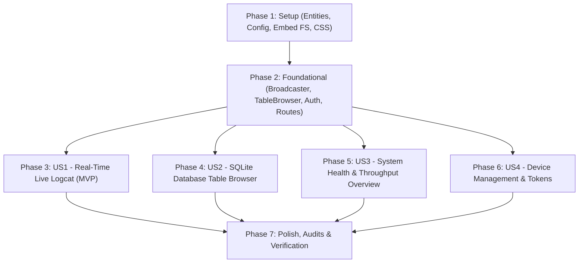

# Tasks: Server Web Dashboard & Live Observability

**Feature**: `specs/004-server-web-dashboard`  
**Date**: 2026-09-13  
**Input**: Feature specification (`spec.md`), implementation plan (`plan.md`), data model (`data-model.md`), and API contracts (`contracts/dashboard-api.md`).

---

## Phase 1: Setup (Shared Infrastructure)

**Purpose**: Define domain structures, configuration flags, embedded asset package, and base styling required across all dashboard views.

- [x] T001 Define domain entities (`LogEntry`, `SystemMetrics`, `TableMetadata`, `TablePage`, `DeviceSummary`, `DatabaseMetrics`, `MessageCounters`) in `relayx-server/internal/domain/dashboard.go`
- [x] T002 Create embedded asset package structure with `//go:embed static/*` declaration in `relayx-server/internal/web/embed.go`
- [x] T003 [P] Create base CSS stylesheet with dark/light themes, card layouts, table styling, and terminal log window styles in `relayx-server/internal/web/static/style.css`
- [x] T004 [P] Add CLI flag `--admin-token` and env `RELAYX_ADMIN_TOKEN` in `relayx-server/internal/config/config.go` and update `relayx-server/internal/config/config_test.go`

---

## Phase 2: Foundational (Blocking Prerequisites)

**Purpose**: Core logging broadcaster, table browser engine, admin authentication, and route serving infrastructure that MUST be complete before user stories can be implemented.

**⚠️ CRITICAL**: Blocks implementation of all user stories.

- [x] T005 Implement thread-safe fan-out `LogBroadcaster` with bounded ring buffer and non-blocking channel dispatch in `relayx-server/internal/logging/broadcaster.go`
- [x] T006 [P] Unit test `LogBroadcaster` verifying non-blocking dispatch and slow consumer backpressure in `relayx-server/internal/logging/broadcaster_test.go`
- [x] T007 Hook `LogBroadcaster` into `RedactingHandler` so all broadcast logs pass through payload redaction in `relayx-server/internal/logging/logger.go`
- [x] T008 Implement read-only SQLite table browser helper with table allowlisting (`messages`, `devices`, `schema_migrations`) and disk stat utilities in `relayx-server/internal/storage/table_browser.go`
- [x] T009 Implement optional admin authentication middleware in `relayx-server/internal/api/middleware.go`
- [x] T010 Register web dashboard static file server under `/dashboard/` in `relayx-server/internal/api/server.go`

**Checkpoint**: Core logging broadcaster, storage browser, and HTTP route foundation verified with unit tests. User story development can now proceed.

---

## Phase 3: User Story 1 - Real-Time Live Log Streaming ("Web Logcat") (Priority: P1) 🎯 MVP

**Goal**: Stream server logs in real time over Server-Sent Events (SSE) to the browser with level filtering, search, auto-scroll, and guaranteed payload/OTP redaction (Constitution Principle III).

**Independent Test**: Connect to `/api/v1/dashboard/logs/stream`, send a message to `POST /api/v1/messages`, and verify that the redacted log event arrives in the browser within 50ms without page reload.

### Tests for User Story 1 ⚠️
- [x] T011 [P] [US1] Unit test SSE log stream handler with subscriber connection lifecycle in `relayx-server/internal/api/dashboard_handler_test.go`

### Implementation for User Story 1
- [x] T012 [US1] Implement SSE handler `HandleLogStream` with heartbeat keep-alive and graceful disconnect cleanup in `relayx-server/internal/api/dashboard_handler.go`
- [x] T013 [US1] Build log viewer UI tab and terminal console container in `relayx-server/internal/web/static/index.html`
- [x] T014 [US1] Implement SSE client logic (`EventSource`), auto-scroll toggle, pause/resume, level filters (`ALL`, `DEBUG`, `INFO`, `WARN`, `ERROR`), and keyword search in `relayx-server/internal/web/static/app.js`

**Checkpoint**: User Story 1 is functional as an MVP. Developers can observe live streaming server logs with zero sensitive data leakage directly from their browser.

---

## Phase 4: User Story 2 - SQLite Database Table Browser & Record Inspection (Priority: P1)

**Goal**: Inspect database tables (`messages`, `devices`, `schema_migrations`) with pagination, column sorting, sender/status filters, modal detail view, and default-masked message bodies.

**Independent Test**: Query `/api/v1/dashboard/database/tables/messages`, verify paginated JSON response, verify masked body in web UI, and toggle plaintext reveal via the eye icon.

### Tests for User Story 2 ⚠️
- [x] T015 [P] [US2] Unit test table listing and parameterized query endpoints in `relayx-server/internal/api/dashboard_handler_test.go`

### Implementation for User Story 2
- [x] T016 [US2] Implement `HandleGetTables` and `HandleQueryTable` with pagination and sorting in `relayx-server/internal/api/dashboard_handler.go`
- [x] T017 [US2] Build Database Browser UI tab, table selector dropdown, pagination controls, and record detail modal in `relayx-server/internal/web/static/index.html`
- [x] T018 [US2] Implement table rendering, sorting, pagination fetch, default masking (`••••••••••••`), and eye reveal toggle in `relayx-server/internal/web/static/app.js`

**Checkpoint**: User Story 2 is functional. Developers can browse database tables, sort columns, and inspect full message metadata without external tools.

---

## Phase 5: User Story 3 - Message Throughput & System Health Overview (Priority: P2)

**Goal**: Overview dashboard displaying real-time message counters (Received, Forwarded, Filtered, Failed), success rates, server uptime, memory usage, and SQLite WAL status.

**Independent Test**: Fetch `/api/v1/dashboard/metrics` and verify metrics cards render on `/dashboard/` with accurate counts.

### Tests for User Story 3 ⚠️
- [x] T019 [P] [US3] Unit test metrics endpoint in `relayx-server/internal/api/dashboard_handler_test.go`

### Implementation for User Story 3
- [x] T020 [US3] Implement `HandleGetMetrics` computing runtime memory, uptime, database sizes, and message counts in `relayx-server/internal/api/dashboard_handler.go`
- [x] T021 [US3] Build Overview tab layout with metric cards (Uptime, Memory, DB Size, WAL Size, Ingestion Counters, Success Rate) in `relayx-server/internal/web/static/index.html`
- [x] T022 [US3] Implement reactive polling/refresh for metrics and health indicators in `relayx-server/internal/web/static/app.js`

**Checkpoint**: User Story 3 is functional. Operators can inspect overall system health and message delivery throughput at a glance.

---

## Phase 6: User Story 4 - Device Management & Token Fingerprint Inspector (Priority: P2)

**Goal**: Manage registered devices, inspect SHA-256 token fingerprints, issue new device tokens, and revoke credentials from the web dashboard.

**Independent Test**: Create a device via the UI, verify the secret token is shown once with copy button, and verify device revocation rejects subsequent ingestion requests.

### Tests for User Story 4 ⚠️
- [x] T023 [P] [US4] Unit test device listing, registration, and revocation handlers in `relayx-server/internal/api/dashboard_handler_test.go`

### Implementation for User Story 4
- [x] T024 [US4] Implement `HandleListDevices`, `HandleRegisterDevice`, and `HandleRevokeDevice` in `relayx-server/internal/api/dashboard_handler.go`
- [x] T025 [US4] Build Device Management tab layout, registration modal with one-time token display, and revocation confirmation in `relayx-server/internal/web/static/index.html`
- [x] T026 [US4] Implement device fetch, registration, clipboard copy feedback, and revocation API calls in `relayx-server/internal/web/static/app.js`

**Checkpoint**: All 4 user stories are functional and testable independently.

---

## Phase 7: Polish & Cross-Cutting Concerns

**Purpose**: Verification, security audits, accessibility compliance, and end-to-end QA.

- [x] T027 [P] Add Constitution Principle III audit tests asserting zero sensitive OTP/payload leakage in SSE stream and default table browser in `relayx-server/internal/api/dashboard_handler_test.go`
- [x] T028 [P] Run full server test suite with `rtk go test -v ./...`
- [x] T029 Compile static binary with `rtk go build -o ../bin/relayx-server ./cmd/server` and test cross-compilation via `Makefile`
- [x] T030 Execute browser manual verification on `http://127.0.0.1:8080/dashboard/` following `specs/004-server-web-dashboard/quickstart.md`
- [x] T031 Document QA results and verification artifacts in `specs/004-server-web-dashboard/qa/`

---

## Dependencies & Execution Order

### Phase Dependencies
- **Setup (Phase 1)**: No dependencies — can start immediately.
- **Foundational (Phase 2)**: Depends on Phase 1 completion. **BLOCKS** all user stories.
- **User Story 1 (Phase 3)**: Depends on Phase 2 completion. Delivers the core live logcat MVP.
- **User Story 2 (Phase 4)**: Depends on Phase 2 completion. Can be implemented concurrently or after US1.
- **User Story 3 (Phase 5)**: Depends on Phase 2 completion. Extends overview metrics.
- **User Story 4 (Phase 6)**: Depends on Phase 2 completion. Extends device administration.
- **Polish (Phase 7)**: Depends on all user stories being complete.

### User Story Dependency Graph

---

## Parallel Opportunities

- **Phase 1**: T003 (`style.css`) and T004 (`config.go`) can run in parallel with T001 (`dashboard.go`).
- **Phase 2**: T006 (`broadcaster_test.go`) can run in parallel with T005 (`broadcaster.go`).
- **Phase 3 & 4**: Once Phase 2 completes, US1 (`HandleLogStream`) and US2 (`HandleQueryTable`) can be developed concurrently.
- **Phase 7**: T027 (Privacy audit tests) and T028 (Full unit tests) can run in parallel.

---

## Implementation Strategy

### MVP First (Phases 1, 2, and 3)
1. Complete Phase 1: Setup (Entities, Config, Embed FS, CSS).
2. Complete Phase 2: Foundational (Broadcaster, Table Browser, Auth, Routes).
3. Complete Phase 3: User Story 1 (Live SSE Logcat Stream with filter & search).
4. **VALIDATE MVP**: Open `http://127.0.0.1:8080/dashboard/`, send an SMS, verify real-time redacted log entry appears.

### Incremental Feature Expansion
1. Add User Story 2: SQLite Table Browser with pagination, sorting, and masked payload preview.
2. Add User Story 3: Overview throughput metrics and server health indicators.
3. Add User Story 4: Device token management and revocation.
4. Run Phase 7 Polish, Constitution Principle III security audits, and browser QA.
